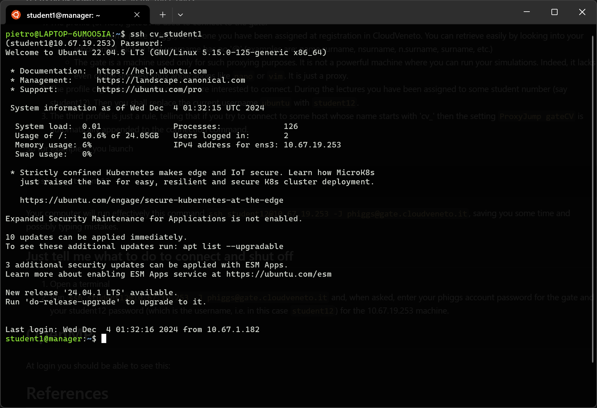
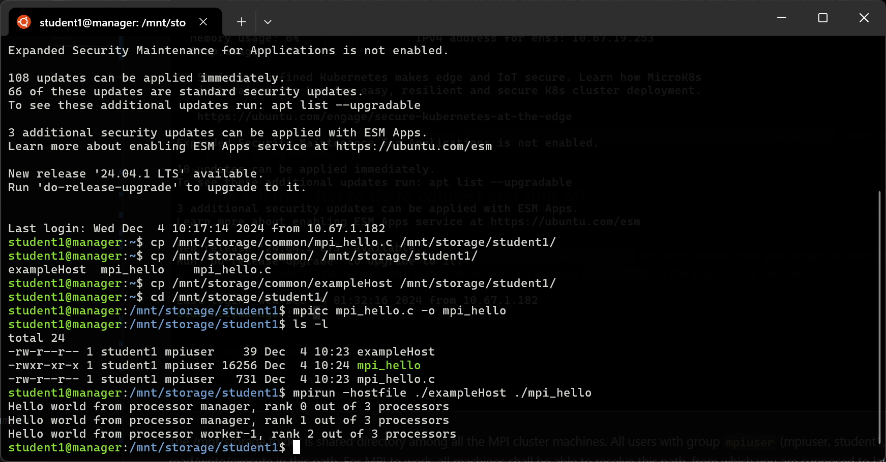

# SSH 101
## What's SSH?
The Secure Shell (SSH) protocol is a method for securely sending commands to a computer over an unsecured network. SSH uses cryptography to authenticate and encrypt connections between devices. SSH also allows for tunneling, or port forwarding, which is when data packets are able to cross networks that they would not otherwise be able to cross. SSH is often used for controlling servers remotely, for managing infrastructure, and for transferring files. [1]

There is very nice starting guide for using SSH [2], covering the following sections.

## How to connect to your machine in CloudVeneto
Any SSH connection is as simple as
```bash
ssh username@ip
```
where `username` is your username and `ip` is the IP address of the machine you want to connect to.

Connection to a CloudVeneto (CV) machine is closed from the general web for security reasons. This means that if you want to connect to a machine within the CV intranet you will need first to access a gateway machine and then connect to the target machine. The gateway is often called just `gate` and the operation of first connecting to the gate and then to your destination machine is called `jumping`. In fact, the gate acts like a proxy and there is a parameter telling the ssh application that you first need to connect to the gate and then to the target machine.
```bash
ssh usernameAtFinalMachine@finalMachineIP -J usernameAtGate@gateIP
```
For example, if your account in CloudVeneto has username 'higgs' and your account in the final CV machine has username `student1` and IP 10.67.19.47 you will run
```bash
ssh student1@10.67.19.47 -J higgs@gate.cloudveneto.it
```

## Simplest connection (how to)
1. Open a terminal
2. Run `ssh student1@10.67.19.47 -J higgs@gate.cloudveneto.it` and, when asked, enter your `higgs` account password for the gate and your `student1` password (which is `password`) for the 10.67.19.47 machine.

## (optional) Profiles
There are a few tips to speed-up the connection process. You can define your own profiles, which alias the connection command with a shorter name. This is done by adding to the `~/.ssh/config` in your system (in Windows something like `C:\Users\yourusername\.ssh\config`) a configuration analogous to the following:
```bash
## CloudVeneto gate
Host gateCV
    HostName gate.cloudveneto.it
    User higgs

## The machine I use for my thesis
Host cv_student1
    HostName 10.67.19.47
    User student1

# Rule that route all machines with name starting with 'cv_' through the CV gate (needed when connecting from home)
Host cv_*
    ProxyJump gateCV
```

Let us break down the code in the three parts:
1. The profile (or host) gateCV is used to connect to the gate.
    - The username (here higgs) is the one you have been assigned at registration in CloudVeneto. You can retrieve easily by looking into your inbox email. Notice that username has no '@' (examples are: name.surname, nsurname, n.surname, surname, etc.)
    - The gate is a machine used only for such proxying purposes. It is not a powerful machine where you can run your simulations. Indeed, it lacks even the simplest linux applications like `nano` or `vim`\. It is just a proxy.
2. The profile cv_student12 is the one you are interested to connect. During the lectures you have been assigned to some student number (say student12). Then you shall replace the current username `ubuntu` with `student12`.
3. The third profile is just a rule, telling that if you try to connect to some host whose name starts with 'cv_' then the setting `ProxyJump gateCV` is automatically appended to the connection command.

So for example, if you launch
```bash
ssh cv_student12
```

Your computer will run effectively this command `ssh student12@10.67.19.47 -J higgs@gate.cloudveneto.it`, saving you some time and possibly typing mistakes.

<hr style="height:0.5em;border:none;color:#333;background-color:#0af;">
<hr style="height:0.5em;border:none;color:#333;background-color:#0af;">

# Open MPI
At login you should be able to see this:


The /mnt/storage folder is shared directory among all the MPI cluster machines. All users with group `mpiuser` (mpiuser, student1, ... , student20) can read/write/execute in this path. For MPI to work, all machines shall be able to resolve this path, from which you are supposed to launch your binary. 

To make some order, each student has its own directory. Also a common directory is created where the instructor can place exercises and scripts.
```bash
ls -la /mnt/storage
total 84
drwxrwxr-x 2 mpiuser   mpiuser 4096 Dec  4 10:21 common
drwxrwxr-x 2 student1  mpiuser 4096 Dec  4 10:20 student1
drwxrwxr-x 2 student10 mpiuser 4096 Dec  4 10:20 student10
drwxrwxr-x 2 student11 mpiuser 4096 Dec  4 10:20 student11
drwxrwxr-x 2 student12 mpiuser 4096 Dec  4 10:20 student12
drwxrwxr-x 2 student13 mpiuser 4096 Dec  4 10:20 student13
drwxrwxr-x 2 student14 mpiuser 4096 Dec  4 10:20 student14
drwxrwxr-x 2 student15 mpiuser 4096 Dec  4 10:20 student15
drwxrwxr-x 2 student16 mpiuser 4096 Dec  4 10:20 student16
drwxrwxr-x 2 student17 mpiuser 4096 Dec  4 10:20 student17
drwxrwxr-x 2 student18 mpiuser 4096 Dec  4 10:20 student18
drwxrwxr-x 2 student19 mpiuser 4096 Dec  4 10:20 student19
drwxrwxr-x 2 student2  mpiuser 4096 Dec  4 10:20 student2
drwxrwxr-x 2 student20 mpiuser 4096 Dec  4 10:20 student20
drwxrwxr-x 2 student3  mpiuser 4096 Dec  4 10:20 student3
drwxrwxr-x 2 student4  mpiuser 4096 Dec  4 10:20 student4
drwxrwxr-x 2 student5  mpiuser 4096 Dec  4 10:20 student5
drwxrwxr-x 2 student6  mpiuser 4096 Dec  4 10:20 student6
drwxrwxr-x 2 student7  mpiuser 4096 Dec  4 10:20 student7
drwxrwxr-x 2 student8  mpiuser 4096 Dec  4 10:20 student8
drwxrwxr-x 2 student9  mpiuser 4096 Dec  4 10:20 student9
```

and quickly run a test of the MPI cluster by using the following 'mpi_hello.c' code. For example copy the mpi_example.c in your own directory in the shared volume


## Important
The example hostfile is like this:
```txt
manager slots=2
ubuntu@worker1 slots=1
```

**It is very important to specify the username 'ubuntu' when trying to access worker1. In case you don't do it the ssh by default goes with the same username of the manager machine, which is 'mpiuser', 'student1' etc.
Since the students are only in the manager machine, will cause the ssh to fail and the mpirun to hang.**


## Hello world code (example)
```c++
#include <mpi.h>
#include <stdio.h>

int main(int argc, char** argv) {
    // Initialize the MPI environment
    MPI_Init(NULL, NULL);

    // Get the number of processes
    int world_size;
    MPI_Comm_size(MPI_COMM_WORLD, &world_size);

    // Get the rank of the process
    int world_rank;
    MPI_Comm_rank(MPI_COMM_WORLD, &world_rank);

    // Get the name of the processor
    char processor_name[MPI_MAX_PROCESSOR_NAME];
    int name_len;
    MPI_Get_processor_name(processor_name, &name_len);

    // Print off a hello world message
    printf("Hello world from processor %s, rank %d out of %d processors\n",
           processor_name, world_rank, world_size);

    // Finalize the MPI environment.
    MPI_Finalize();
}
```


<hr style="height:0.5em;border:none;color:#333;background-color:#0af;">
<hr style="height:0.5em;border:none;color:#333;background-color:#0af;">
<hr style="height:0.5em;border:none;color:#333;background-color:#0af;">
<hr style="height:0.5em;border:none;color:#333;background-color:#0af;">

# (danger zone)
## Cluster configuration script for manager 
```bash
#!/bin/bash

# Set DEBIAN_FRONTEND to noninteractive to avoid prompts
export DEBIAN_FRONTEND=noninteractive

# Update and upgrade the system
sudo apt-get update -y

# Install OpenMPI, SSH server, and NFS server
sudo apt-get install -y openmpi-bin libopenmpi-dev openmpi-doc openssh-server nfs-kernel-server net-tools

# Create mpiuser
sudo adduser --disabled-password --gecos "" mpiuser
echo "mpiuser:password" | sudo chpasswd
sudo usermod -aG sudo mpiuser

# Generate SSH keys for mpiuser (if they don't already exist)
if [ ! -f /home/mpiuser/.ssh/id_rsa ]; then
    sudo -u mpiuser ssh-keygen -t rsa -N "" -f /home/mpiuser/.ssh/id_rsa
fi

# Set proper permissions for the .ssh directory and the keys
sudo mkdir -p /home/mpiuser/.ssh
sudo chmod 700 /home/mpiuser/.ssh
sudo chmod 600 /home/mpiuser/.ssh/id_rsa

# Append the public key to authorized_keys (if not already added)
PUBLIC_KEY=$(sudo cat /home/mpiuser/.ssh/id_rsa.pub)
echo "$PUBLIC_KEY" | sudo tee -a /home/mpiuser/.ssh/authorized_keys

# Set the correct permissions for the authorized_keys file
sudo chmod 600 /home/mpiuser/.ssh/authorized_keys
sudo chown -R mpiuser:mpiuser /home/mpiuser/.ssh

# Create mpiuser group
sudo groupadd mpiuser

# Add student1 to student20 accounts and add them to the mpiuser group
for i in {1..20}; do
    USER="student$i"
    sudo adduser --disabled-password --gecos "" $USER
    echo "$USER:password" | sudo chpasswd
    sudo usermod -g mpiuser $USER
    sudo usermod -aG $USER $USER
    
    # Create the .ssh directory for each student user
    sudo mkdir -p /home/$USER/.ssh
    sudo chmod 700 /home/$USER/.ssh
    
    # Copy the public key to authorized_keys for passwordless SSH login
    sudo cp /home/mpiuser/.ssh/authorized_keys /home/$USER/.ssh/
    sudo chmod 600 /home/$USER/.ssh/authorized_keys
    sudo chown -R $USER:$USER /home/$USER/.ssh
done

# Configure shared /etc/hosts for all nodes
# Fetch the manager's IP address dynamically (assumes eth0 is the interface; adjust as needed)
INTERFACE=$(ifconfig | grep -oP '^(eth[0-9]+)' | head -n 1)
MANAGER_IP=$(ifconfig $INTERFACE | grep -oP 'inet \K[\d.]+' | grep -v '127.0.0.1')

echo "$MANAGER_IP manager" | sudo tee -a /etc/hosts
echo "10.67.19.160 worker1" | sudo tee -a /etc/hosts

# # Format and mount /dev/vdb
# sudo mkfs -t ext4 /dev/vdb
# sudo e2label /dev/vdb storage
sudo mkdir -p /mnt/storage

# Mount the shared volume in the storage in manager
sudo mount /dev/vdb /mnt/storage

# Set the owner of /mnt/storage to the mpiuser group
sudo chown -R mpiuser:mpiuser /mnt/storage

# Give read/write/execute permissions to the group (mpiuser group)
sudo chmod -R 770 /mnt/storage

# Update /etc/exports to allow NFS access to all clients
echo "/mnt/storage *(rw,sync,no_root_squash,no_subtree_check)" | sudo tee -a /etc/exports

# Start the NFS server
sudo systemctl restart nfs-kernel-server

# Export the NFS file system
sudo exportfs -a

# Configure SSH server to allow password login
sudo sed -i 's/^#*PasswordAuthentication no/PasswordAuthentication yes/' /etc/ssh/sshd_config
sudo sed -i 's/^#*PermitRootLogin prohibit-password/PermitRootLogin no/' /etc/ssh/sshd_config

# Enable password authentication and interactive login
echo -e "\n# Enable password and public key authentication\nPasswordAuthentication yes\nPubkeyAuthentication yes" | sudo tee -a /etc/ssh/sshd_config
# Check if KbdInteractiveAuthentication is present and modify it; if not, append it
if grep -q "^KbdInteractiveAuthentication" /etc/ssh/sshd_config; then
    sudo sed -i 's/^KbdInteractiveAuthentication.*/KbdInteractiveAuthentication yes/' /etc/ssh/sshd_config
else
    echo -e "\n# Enable keyboard-interactive authentication\nKbdInteractiveAuthentication yes" | sudo tee -a /etc/ssh/sshd_config
fi

sudo systemctl restart sshd


# Set up symbolic links for all students and mpiuser in their home directories
for user in mpiuser student{1..20}; do    
    # Create the symbolic link pointing to the shared /mnt/storage directory
    sudo ln -s /mnt/storage /home/$user/cloud
    
    # Set ownership of the symlink to the user:mpiuser group
    sudo chown -h $user:mpiuser /home/$user/cloud
    
    # Set permissions to allow the mpiuser group to write to the cloud directory
    # sudo chmod 775 /home/$user/cloud
done

# Finalize setup
echo "MPI cluster setup complete."
```


# References
- [1] https://www.cloudflare.com/learning/access-management/what-is-ssh/
- [2] https://www.digitalocean.com/community/tutorials/ssh-essentials-working-with-ssh-servers-clients-and-keys